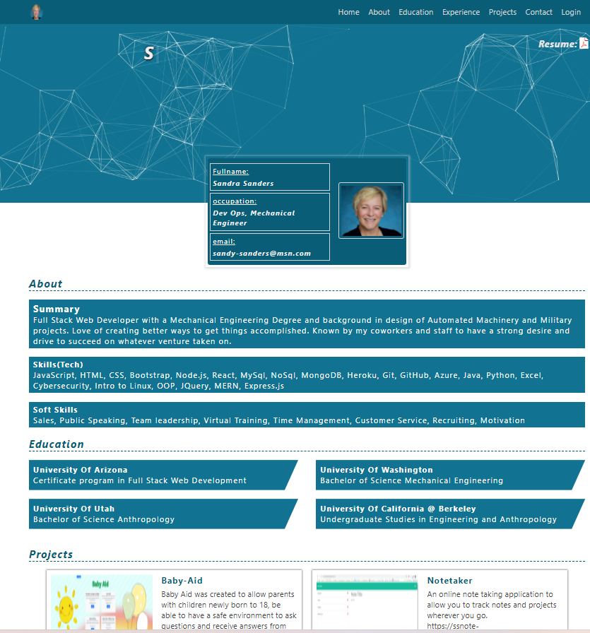

# SSanders-portfolio

## Description
Fully functional React portfolio with custom CSS to show case my work and experience. It has a downloadable resume and a link button to my linkedIn page. There are sections for skills, projects, experience and education.
It is deployed at  https://ssanders-portfolio.herokuapp.com/ .

## Table of Contents
*[Description](#description)
*[Installation](#installation)
*[Usage](#usage)
*[Credits](#credits)
*[License](#license)
*[Contact](#contact)

## Installation
The following dependencies must be installed 
    axios": "^0.27.2",
    "react": "^18.1.0",
    "react-dom": "^18.1.0",
    "react-router-dom": "^6.3.0",
    "react-scripts": "5.0.1",
    "react-scroll": "^1.8.7",
    "react-tsparticles": "^2.0.6",
    "react-typewriter-effect": "^1.1.0",
    "web-vitals": "^2.1.4"
It was built using react tsparticles and typewriter effects. Once you have those installed you can run start and see the application in the browser.

## Useage
The application is deployed on heroku at https://ssanders-portfolio.herokuapp.com/.

## Credits
The training for this was from a class on Udemy.com by Odysseas Kolas.
I revamped and changed it for myself.

## License
none

## Contact
For more information or comments 
Sandra Sanders @ email: sandy-sanders@msn.com

